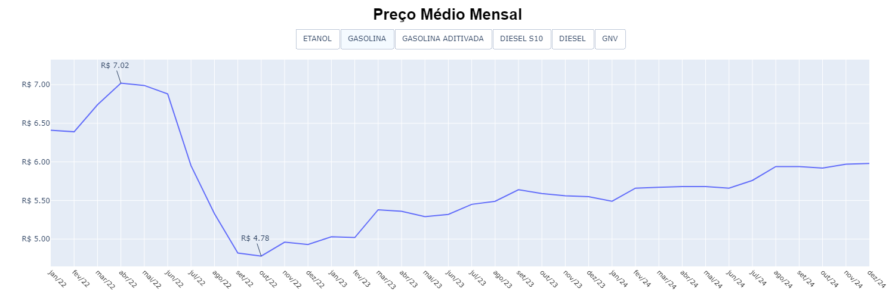

# Combustíveis da Cidade de São Paulo

Análise dos preços dos combustíveis automotivos da cidade de São Paulo entre os anos 2022 e 2024.

Dados extraidos do Portal de Dados Abertos do Governo Federal que foram fornecidos pela [Agência Nacional do Petróleo, Gás Natural e Biocombustíveis - ANP](https://dados.gov.br/dados/conjuntos-dados/serie-historica-de-precos-de-combustiveis-e-de-glp).

OBS: Os dados não são de todos os postos de combustiveis da cidade, apenas daqueles que a ANEP possui informação.

## Bibliotecas

- [pandas](https://pandas.pydata.org/docs/)
- [matplotlib](https://matplotlib.org/stable/users/index.html)
- [numpy](https://numpy.org/)
- [seaborn](https://seaborn.pydata.org/)
- [plotly](https://plotly.com/python/)
- [datetime](https://docs.python.org/3/library/datetime.html)
- [calendar](https://docs.python.org/3/library/calendar.html)
- [locale](https://docs.python.org/pt-br/3.8/library/locale.html)

## Questionamentos

Para cada tipo de combustível:

- Valor médio por ano de cada tipo de combustível
- Valor médio por mês de cada tipo de combustível
- Série temporal dos valores mínimos, média e máxima
- Qual bandeira possui mais revendedoras?
- Qual bandeira possui maior e menor preço médio?
- Quantos litros é possível comprar com um salário mínimo?
- Gastos com abastecimento de um automóvel que percorre todos os dias, exceto finais de semana e feriados, 60 Km.

## Tratamento dos dados

- Importação dos arquivos. Cada arquivo possui os dados semestrais de cada ano.
- As colunas que serão utilizadas na análise não possuem valores nulos.
- Exclusão das colunas desnecessárias para a análise.
- Filtrado apenas para a cidade de São Paulo
- Concatenação dos arquivos em um único dataframe.
- Renomeação de algumas colunas para facilitar o uso nos algoritmos.
- Criação das colunas "Ano", "Mes", "Mes Nome", "Semana" para posterior agregação
- Criação da coluna "Desvio Semana" que é resultado da média semanal dividido pelo "Valor de Venda" que pertence àquela semana.

## Visualização dos Dados

### ScatterPlot

Obs: É um tipo de gráfico que não é recomendado para grande volume de dados, pois consome muita memória para extrair insights que é possível com outros tipos de gráficos.

- É possível visualizar um ponto muito acima do restante no DIESEL S10.
- É possível visualizar um ponto muito abaixo do restante no DIESEL.
- Ambos valores serão retirados por serem considerados exceção mesmo dentro dos outliers.

---

### BoxPlot

- Confirma os valores muito distantes encontrados no ScatterPlot.
- Com exceção dos valores mencionados acima, os outliers não serão retirados da análise. Isso mostra que há lugares que cobram valores bem acima da média.
- Devido a grande amplitude nos valores no ano de 2022, apresentou poucos valores considerados outliers quando em comparação com outros anos.
- Fica evidente que há muito lugares que cobram preços bem acima.

---

|                    |           | OUTLIERS  |            |        |            |        |
| ------------------ | :-------: | :-------: | :--------: | :----: | :--------: | :----: |
|                    |   2022    |           |    2023    |        |    2024    |        |
|                    |   Acima   |  Abaixo   |   Acima    | Abaixo |   Acima    | Abaixo |
| ETANOL             |     0     |     0     | 552 (5.6%) |   0    | 439 (4.3%) |   0    |
| GASOLINA           |     0     |     0     | 710 (7.2%) |   0    |  620 (6%)  |   0    |
| GASOLINA ADITIVADA |     0     |     0     | 419 (4.2%) |   0    | 569 (5.8%) |   0    |
| DIESEL S10         | 24 (0.4%) | 30 (0.5%) | 159 (2.6%) |   0    | 172 (2.7%) |   0    |
| DIESEL             |     0     | 7 (0.6%)  | 17 (1.1%)  |   0    | 91 (5.6%)  |   0    |
| GNV                | 13 (1.6%) | 14 (1.7%) |     0      |   0    | 16 (1.5%)  |   0    |

---

### Gráfico de Densidade

A partir de um gráfico de densidade com compartimentos de tamanho 0.5 é possível visualizar que:
- 2022 apresentou maior amplitude de variação em comparação aos outros anos, confirmado pela quantidade maior de barras no gráfico. 

---

### Média Móvel dos Preços: Mínimo, Média e Máximo

#### Etanol

- Em maio de 2022, houve uma diminuição considerável no preço dos combustíveis. Em 4 meses houve um redução de 60% no preço.
- Após a redução, no período de 2 anos é possível visualizar uma sazonalidade de amplitude R$ 0,90.

#### Gasolina, Gasolina Aditivada

- Apesar de a mínima, média e máxima apresentarem uma curvatura de tendência parecida, é possível visualizar que a máxima difere da média muito mais em relação a mínima.
- Em julho de 2022, houve uma diminuição considerável no preço dos combustíveis. Em 2 meses houve um redução de 66% no preço.
- Após a redução, no período de 2 anos houve um crescimento estável de 30%.

#### Diesel, Diesel S10

- Apesar de ser derivada do petróleo, a queda de preço a partir de julho de 2022 não foi tão brusca quanto a da gasolina, em 13 meses houve uma redução de 66%. Porém durou até agosto de 2023 e foi seguida por um aumento de 20% em apenas 1 mês.

#### GNV

- Apesar de ser derivada do petróleo, a queda de preço a partir de julho de 2022 não foi tão brusca quanto a da gasolina, em 13 meses houve uma redução de 66%. Porém durou até agosto de 2023 e foi seguida por um aumento de 20% em apenas 1 mês.

---

### Preço Médio Mensal

</figure>

---

### Preço Médio Anual 

---

### Quantidade de Revendedoras por Bandeira

---

### Preço Médio por Bandeira em 2024

---

### Gasto com Abastecimento a cada X dias
Foi construido um algoritmo para calcular os dias que seria feito o abastecimento e o custo para abastecer.

- Levando em consideração:
  - Um tanque de 50 litros.
  - O trajeto de ida e volta é de 60km
  - Apenas em dias úteis e entre 07h e 18h.
  - Caso o cálculo para o abastecimento seja abaixo de 07h, será considerado 07h. Não foi considerado rodízio de veículos pela placa.
  - Caso o cálculo de para o abastecimento seja acima de 18h, a hora adicional será somada ao próximo dia.
  - Consumo médio por litro de um carro popular.

#### Gasto a cada X dias

- Apresenta uma linha de tendência similar a série temporal do preço médio.

---

#### Gasto Mensal

- Os picos e vales são os casos em que há mais ou menos de 3 abastecimentos.

#### Gasto Anual

- Levando em consideração os salários mínimos:
  - 2022: R$ 1.212 * 12 meses = R$ 14.544
  - 2023: R$ 1.320 * 12 meses = R$ 15.840
  - 2024: R$ 1.412 * 12 meses = R$ 16.944
  
- Etanol:
  - 2022: R$ 9.640 = 66% do salário mínimo
  - 2023: R$ 8.034 = 50% do salário mínimo
  - 2024: R$ 8.412 = 50% do salário mínimo

- Gasolina:
  - 2022: R$ 10.979 = 75% do salário mínimo
  - 2023: R$ 9.680 = 60% do salário mínimo
  - 2024: R$ 10.774 = 63% do salário mínimo

---

### Litros por Salário Mínimo

- Em 2022 apresentou pior resultado.
- Em 2023 apresentou melhor resultado.
- Em 2024 apresentou uma média entre os dois.

