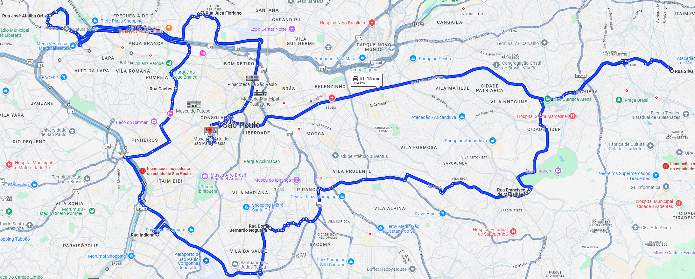

<h1 style="font-size: 30px;">🚚 Melhor Rota de Entrega</h1>

Projeto para determinar a melhor rota com base nos endereços fornecidos. Algoritmos pensados para resolver o Problema do Caixeiro Viajante (TSP - Travelling Salesman Problem). Baseado no exemplo fornecido pelo <a src="https://developers.google.com/optimization/routing/tsp?hl=pt-br">Google OR-Tools</a>.

<h2 style="font-size: 24px;">✔️ Requisitos</h2>
<ul style="font-size: 16px;">
    <li>Biblioteca
        <ul>
            <li>
                <a src="https://pandas.pydata.org/docs/">pandas</a>
            </li>
            <li>
                <a src="https://github.com/googlemaps/google-maps-services-python">googlemaps</a>
            </li>
            <li>
                <a src="https://github.com/google/or-tools">ortools</a>
            </li>
        </ul>
    </li>
 
    <li>Google Maps API KEY
        <ul>
            <li>
                Geocoding
            </li>
            <li>
                Distance Matrix API
            </li>
            <li>
                Maps JavaScript API
            </li>
        </ul>
    </li>
</ul>

<h2 style="font-size: 24px;">Exemplo</h2>

<code>

    starting_point = "Avenida Paulista, São Paulo, SP"

    delivery_addresses = [
        "Rua Francisco de Magalhães, Jardim Nove de Julho, São Paulo, SP",
        "Rua Dom Bernardo Nogueira, Vila Gumercindo, São Paulo, SP",
        "Rua Indiana, Brooklin Paulista, São Paulo, SP",
        "Rua Antônio Moreira, Pari, São Paulo, SP",
        "Rua Silva, Núcleo Lageado, São Paulo, SP",
        "Rua Caetés, Perdizes, São Paulo, SP",
        "Rua Juca Floriano, Casa Verde Média, São Paulo, SP",
        "Rua José Ataliba Ortiz, Vila Mangalot, São Paulo, SP"
    ]

    df = BestRouteTSP(API_KEY, starting_point, delivery_addresses).to_dataframe()

<table border="1" class="dataframe">
  <thead>
    <tr style="text-align: right;">
      <th>Delivery</th>
      <th>Address</th>
      <th>Distance (m)</th>
      <th>Duration (min)</th>
    </tr>
  </thead>
  <tbody>
    <tr>
      <td>1</td>
      <td>Rua Antônio Moreira, Pari, São Paulo, SP</td>
      <td>8002</td>
      <td>16</td>
    </tr>
    <tr>
      <td>2</td>
      <td>Rua Juca Floriano, Casa Verde Média, São Paulo...</td>
      <td>7755</td>
      <td>14</td>
    </tr>
    <tr>
      <td>3</td>
      <td>Rua José Ataliba Ortiz, Vila Mangalot, São Pau...</td>
      <td>10991</td>
      <td>19</td>
    </tr>
    <tr>
      <td>4</td>
      <td>Rua Caetés, Perdizes, São Paulo, SP</td>
      <td>13313</td>
      <td>23</td>
    </tr>
    <tr>
      <td>5</td>
      <td>Rua Indiana, Brooklin Paulista, São Paulo, SP</td>
      <td>12080</td>
      <td>25</td>
    </tr>
    <tr>
      <td>6</td>
      <td>Rua Dom Bernardo Nogueira, Vila Gumercindo, Sã...</td>
      <td>10467</td>
      <td>21</td>
    </tr>
    <tr>
      <td>7</td>
      <td>Rua Francisco de Magalhães, Jardim Nove de Jul...</td>
      <td>18334</td>
      <td>46</td>
    </tr>
    <tr>
      <td>8</td>
      <td>Rua Silva, Núcleo Lageado, São Paulo, SP</td>
      <td>16125</td>
      <td>35</td>
    </tr>
    <tr>
      <td>9</td>
      <td>Avenida Paulista, São Paulo, SP</td>
      <td>39859</td>
      <td>59</td>
    </tr>
  </tbody>
</table>

</code>

<h3 style="font-size: 20px;">Delivery Route</h3>
