# :umbrella: Predict Rainfall

This project uses the XGBoost algorithm to predict rainfall ocurrence. The dataset is balanced using the ADASYN technique, and the model's hyperparameters are optimized with Optuna to maximize the AUC (Area Under the Curve).

Source: [Binary Prediction with a Rainfall Dataset](https://www.kaggle.com/datasets/subho117/rainfall-prediction-using-machine-learning)

## Project Structure

- `rainfall.ipynb`: Jupyter Notebook containing the code for data analysis, training and evaluating the model.
- `train.csv`: dataset for training the model
- `test.csv`: dataset for prediction

## :book: Requisites (Libraries / Frameworks)

- Python 3.12
- pandas==2.2.3
- numpy2.2.3
- scipy==1.15.2
- matplotlib==3.10.1
- seaborn==0.13.2
- plotly==6.0.0
- scikit-learn==1.1.1
- xgboost==3.0.0
- optuna==4.2.1
- joblib==1.4.1
- CUDA-compatible Nvidia graphics card or change device in hyperparameters.
- cupy-cuda12x==13.4.0 - Check your CUDA version.

<hr>

## :chart_with_upwards_trend: Analysis

- ### Density

<div>
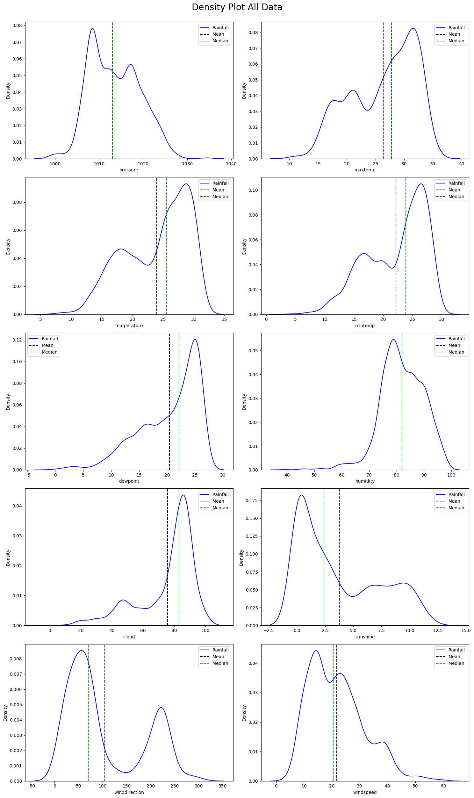
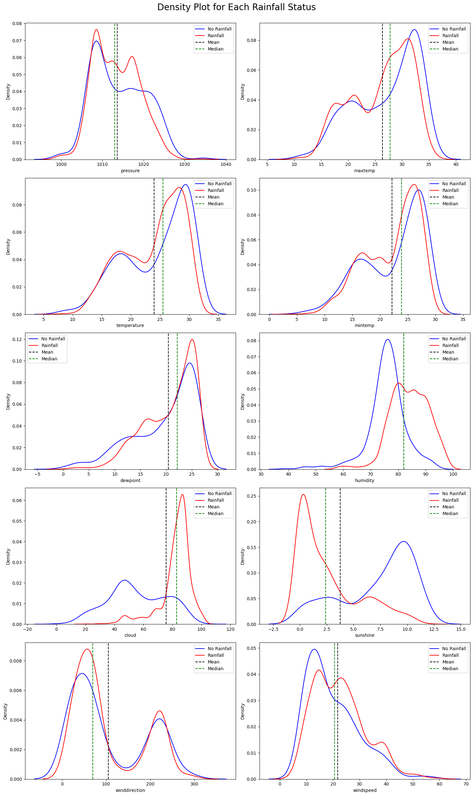
</div>

- ### Correlation

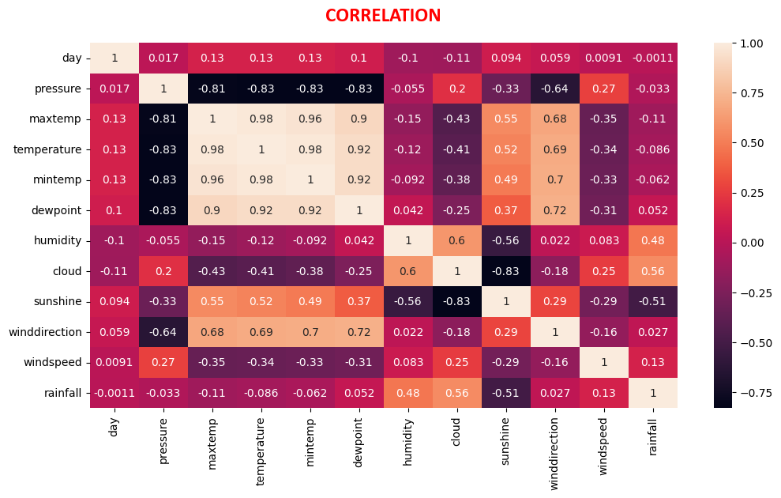

- ### Matrix Scatter Plot

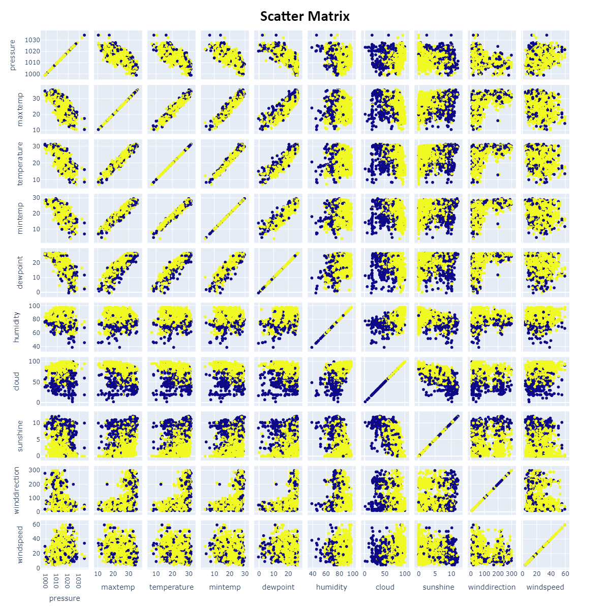

- ### BoxPlot

<div>
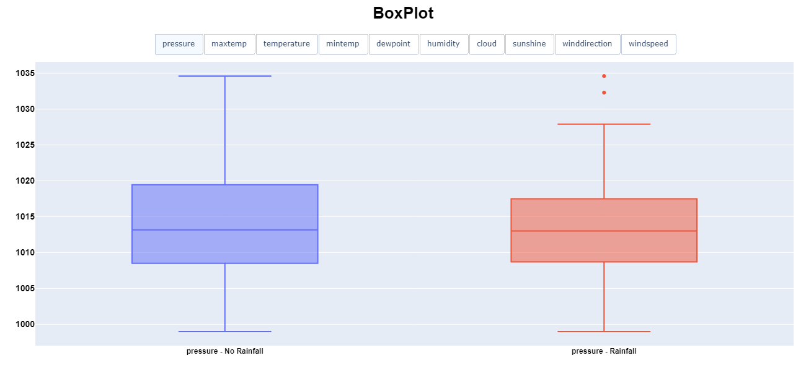
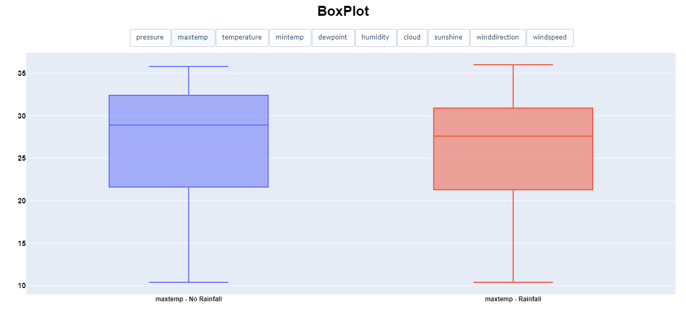
</div>
<div>
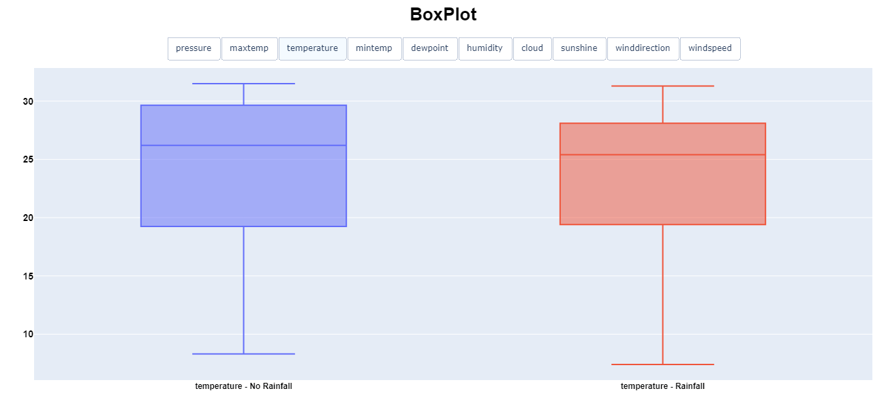
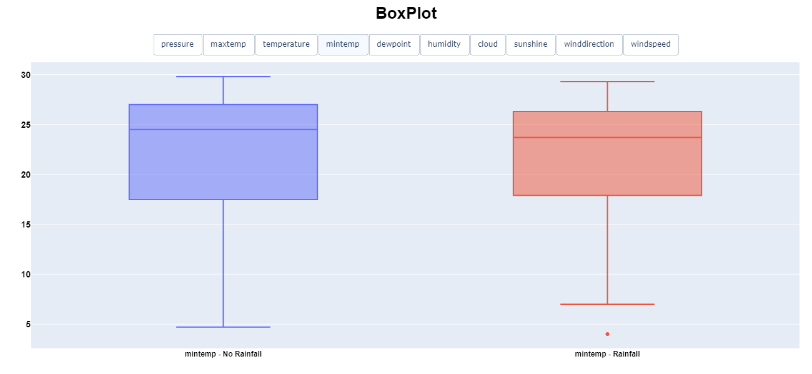
</div>
<div>
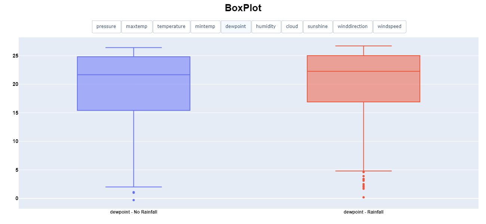
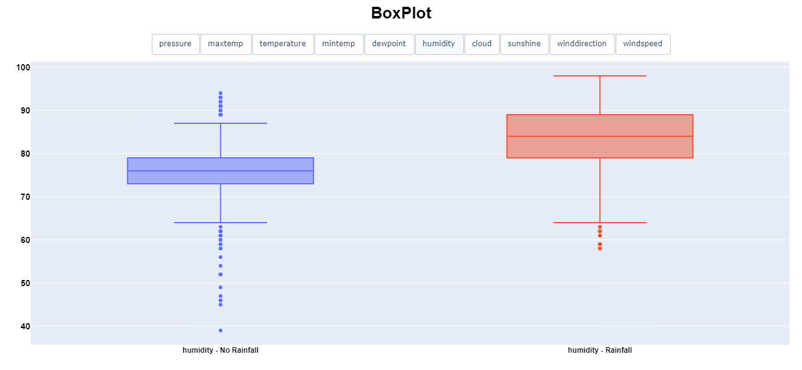
</div>
<div>
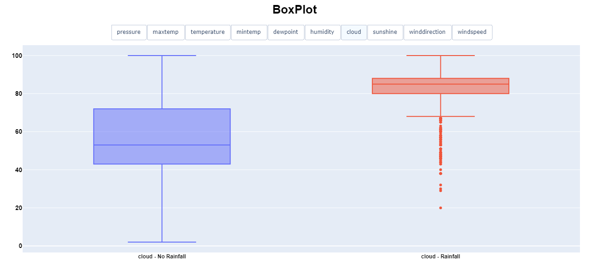
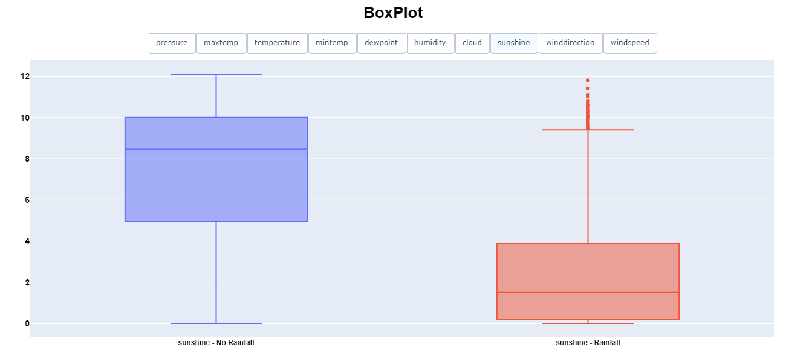
</div>
<div>
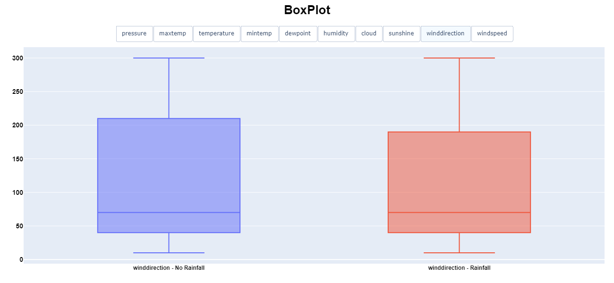
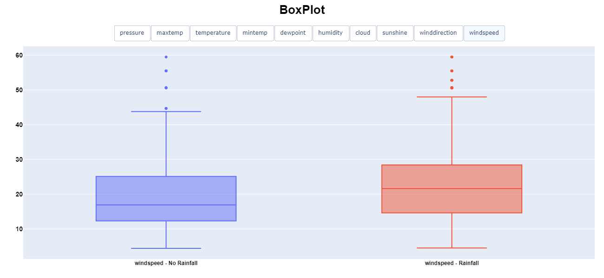
</div>

<hr>

## :robot: Machine Learning Model

### ***Preprocessing***

- Applying preprocessing techniques such as `StandardScaler`, `RobustScaler`. `MinMax`, among others, did not improve the model's result.
- Decomposition techniques like PCA and TSNE were tested but not used in the final model.
- The dataset was splitted into train and test by `80/20`.
- The dependent variable `rainfall` has a `3:1` distribution, so the `ADASYN` technique was applied to balance the classes.

### ***Training***

```python
# The XGBoost model is trained using the GPU to speed up the process

# Check if GPU is available
try:
  cuda_available = cp.cuda.runtime.getDeviceCount() > 0
except ImportError:
  cuda_available = False

# Set the model hyperparameters
  device = "cuda" if cuda_available else "cpu"
  tree_method = "gpu_hist" if cuda_available else "hist"
```

```python
# Split data into features and target
X = df_train.drop(columns=["rainfall"])
Y = df_train["rainfall"]

# Split data into train and test
X1, X2, Y1, Y2 = train_test_split(
  X, Y, test_size=0.2, random_state=42, stratify=Y)

# Resample train data using ADASYN
X1_resampled, Y1_resampled = ADASYN(
  random_state=42,n_neighbors=7).fit_resample(X1, Y1)
```

```python
# Function to tuning the hyperparameters and find the best model
def objective(trial):

  # hyperparameters
  params = {
    # Use GPU
    "device": device,

    # Optimize for GPU
    "tree_method":tree_method,

    # Binary Classification
    "objective": "binary:logistic",

    # Metric to evaluate - Area Under the Curve
    "eval_metric": "auc",

    # Random Seed
    "random_state": 42,

    # Verbosity of printing messages
    "verbosity": 0

    # Number of trees
    "n_estimators": trial.suggest_int("n_estimators", 50, 200),

    # Maximum depth of the tree
    "max_depth": trial.suggest_int("max_depth", 1, 10), 

    # Learning rate
    "learning_rate": trial.suggest_float("learning_rate", 0.01, 0.3),  

    # Subsample ratio of the training instances
    "subsample": trial.suggest_float("subsample", 0.1, 1), 

    # Subsample ratio of columns when constructing each tree
    "colsample_bytree": trial.suggest_float("colsample_bytree", 0.1, 1),

    # Minimum loss reduction required to make a further partition on a leaf node of the tree
    "gamma": trial.suggest_float("gamma", 0, 1),

    # Minimum sum of instance weight (hessian) needed in a child
    "min_child_weight": trial.suggest_int("min_child_weight", 1, 10),

    # L1 regularization term on weights
    "reg_alpha": trial.suggest_float("reg_alpha", 0.001, 0.1),

    # L2 regularization term on weights
    "reg_lambda": trial.suggest_float("reg_lambda", 0.001, 0.1),

    # Early stopping
    "early_stopping_rounds": 20,

    # Print logs
    "verbose": False,
  }

  auc_scores = [] # List AUC Scores

  model = xgb.Classifier(**params) # Create model 

  # Cross Validation
  cv = StratifiedKFold(n_splits=5, shuffle=True, random_state=42)

  # Manual Cross Validation
  for train_index, test_index in cv.split(X1_resampled, Y1_resampled):
    X_train, X_test = X1_resampled.iloc[train_index], X1_resampled.iloc[test_index]
    Y_train, Y_test = Y1_resampled.iloc[train_index], Y1_resampled.iloc[test_index]
    
    # Model train
    model.fit(
        X_train,
        Y_train,
        eval_set=[(X_test, Y_test)], # Validation Set
        verbose=False,
    )

    Y_pred = model.predict(X_test) # Prediction
    Y_proba = model.predict_proba(X_test)[:, 1] # Prediction probability
    auc_score = roc_auc_score(Y_test, Y_proba) # AUC score
    auc_scores.append(auc_score) # Add to list

return np.mean(auc_scores) # Return the average AUC score
```

```python
# Study to find the best model

# Maximize the AUC Score. MedianPruner by default
study = optuna.create_study(direction="maximize", study_name="rainfall_1")

# Optimize the study
study.optimize(objective, n_trials=100, show_progress_bar=True)

# Store the best trial
trial = study.best_trial

# Print the best ROC AUC found and its hyperparameters
print("Best Trial:")
print(f"ROC AUC: {trial.value:.4f}")
print("Params: ")
for key, value in trial.params.items():
    print(f"    {key}: {value:.4f}")
```

```python
# Use the best hyperparameters to train the model

# The same hyperparameters used to train the model
# PS: The model shows better result using the raw train data balanced by the hyperparameter `scale_pos_weight`.
param = {
    "device": "cuda",
    "tree_method": "hist",
    "objective": "binary:logistic",
    "eval_metric": "auc",
    "random_state": 42,
    "verbosity": 0,
    "scale_pos_weight": Y1[Y1 == 0].shape[0] / Y1[Y1 == 1].shape[0], # PS
    "early_stopping_rounds": 20,
    "verbose": False,
    **trial.params,
}

# Train model
model = xgb.XGBClassifier(**param)
model.fit(X1, Y1, eval_set=[(X2, Y2)], verbose=False)
```

### ***Results***

```text
Best Trial: 43
ROC AUC: 0.9596
Params: 
    n_estimators: 132.0000
    max_depth: 8.0000
    learning_rate: 0.2188
    subsample: 0.8739
    colsample_bytree: 0.3387
    gamma: 0.0113
    min_child_weight: 1.0000
    reg_alpha: 0.0383
    reg_lambda: 0.0744
```

<hr>

***Optimization History***

```python
# Plot Optimization History
optuna.visualization.plot_optimization_history(study).show()
```

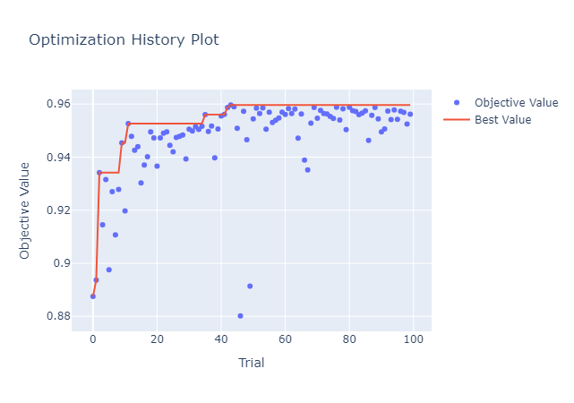

<hr>

***Parameter Importances***

```python
# Plot Parameter Importances
fig = optuna.visualization.plot_param_importances(study)
fig.show()
```

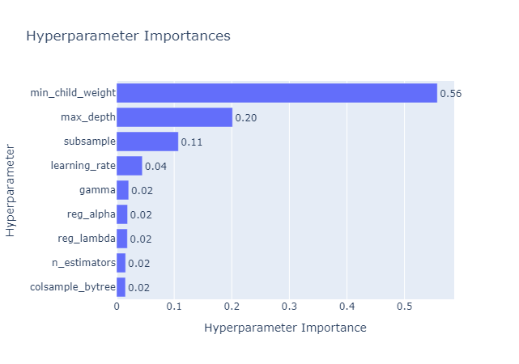

<hr>

***Model with Test Data***

```text
---Model with Test Data:---
Accuracy: 0.8539
Precision: 0.9156
Recall: 0.8879
F1: 0.9015
ROC AUC: 0.8759
Log Loss: 0.3846
```

<hr>

***Feature Importance***

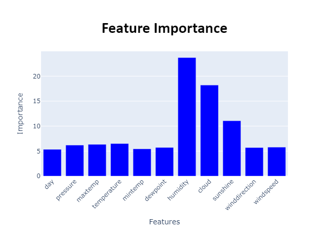

<hr>

***Confusion Matrix***

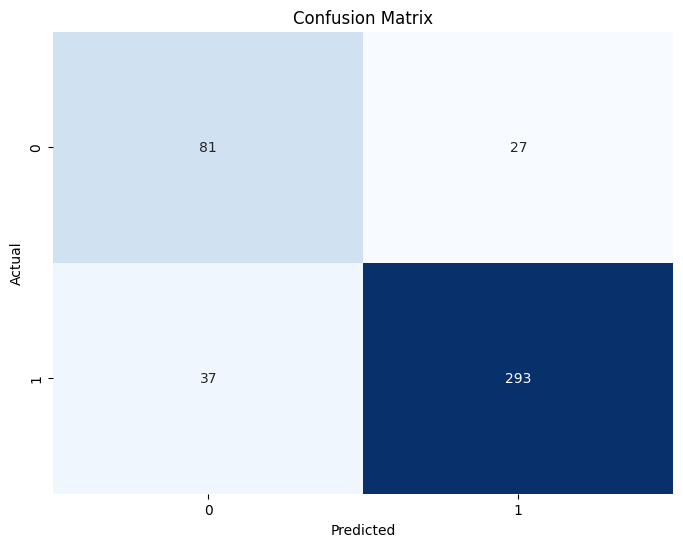

<hr>

***ROC Curve***

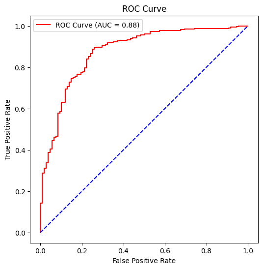

<hr>

***Metrics by Thresholds (ROC Curve)***

```python
# False Positive Rate, True Positive Rate, Thresholds
fpr, tpr, thresholds = roc_curve(Y2, Y_proba)
```

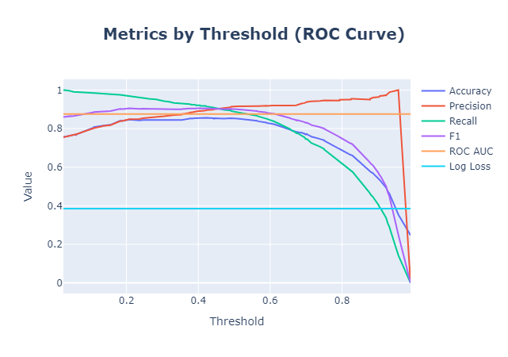

<hr>

***Optimal Threshold***

```text
-----------Optimal Threshold:-----------
Optimal Threshold: 0.4050
Accuracy: 0.8562
Precision: 0.8915
Recall: 0.9212
F1: 0.9061
ROC AUC: 0.8759
Log Loss: 0.3846
```

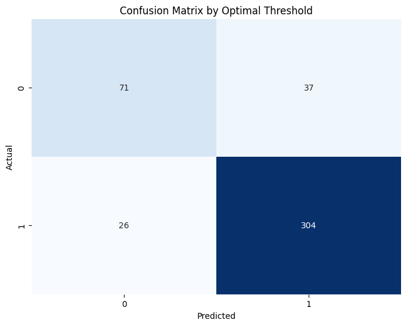